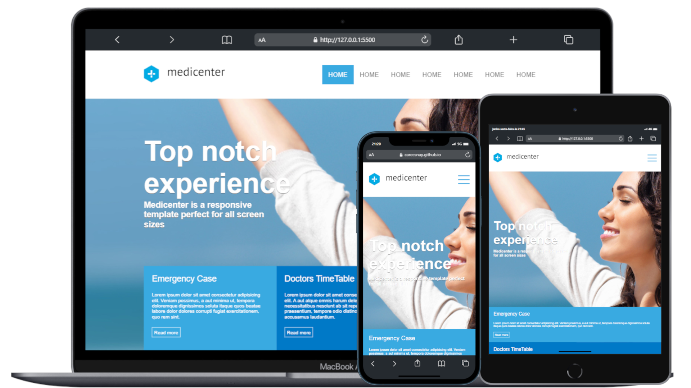

<h1 align="center">Medicenter</h1>

  <a href="#-Deployment">Deployment</a>&nbsp;&nbsp;|&nbsp;&nbsp;
  <a href="#-Tecnologias">Tecnologias</a>&nbsp;&nbsp;|&nbsp;&nbsp;
  <a href="#-Projeto">Projeto</a>&nbsp;&nbsp;|&nbsp;&nbsp;
  <a href="#-Recursos">Recursos</a>&nbsp;&nbsp;|&nbsp;&nbsp;
  <a href="#-Layout">Layout</a>&nbsp;&nbsp;&nbsp;&nbsp;

## 🌐 Deployment

Você pode visualizar o deploy do projeto através desse link:
 🟢[GitHub Pages](https://carecsnay.github.io/Medicenter/) 

  <h3 align="center">Prévia Real do Projeto</h3>
  

## 🚀 Tecnologias

Esse projeto foi desenvolvido com as seguintes tecnologias:

- HTML5 
- CSS3
- JS

## 💻 Projeto

Este é um clone do projeto Medicenter, criado com o objetivo de aprimorar meus conhecimentos em JavaScript, HTML e CSS. O Medicenter é um site responsivo e intuitivo, projetado para uma clínica médica fictícia.

## 🧠 Recursos
- Design responsivo e amigável, adaptado para diferentes dispositivos e tamanhos de tela.
- Página inicial com informações sobre a clínica, sua missão e valores.
- Seções dedicadas a diferentes especialidades médicas oferecidas pela clínica.
- Seção informativa para acompanhamento de novas notícias.
- Seção de departamentos.
- Seção de contato.
- Seção de seguros médicos.
## 🔖 Layout

Você pode conferir o Layout no [link](https://quanticalabs.com/wp_themes/medicenter/home/).

---

Todos os direitos reservados a [quanticalabs](https://quanticalabs.com/).
